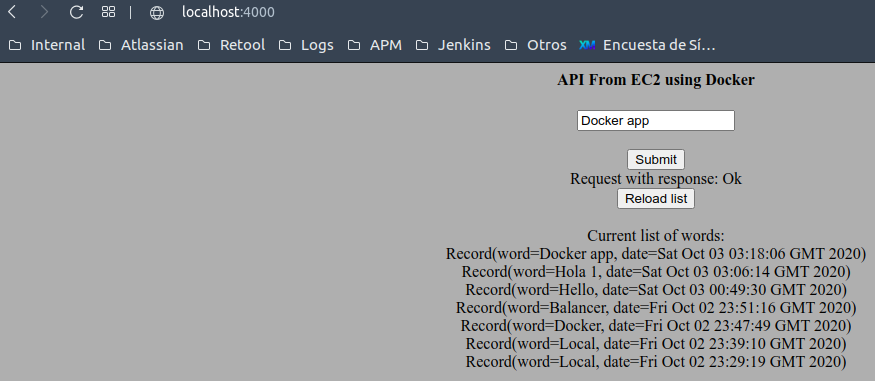

# Simple Spark/Mongo app with docker
En este proyecto se presenta una aplicación simple con un front estático que se encarga de hacer request al API REST
* El API se recibe una cadena, la almacena en la base de datos y responde con las 10 ultimas cadenas almacenadas en
la base de datos y la fecha en que fueron almacenadas.
* De base de datos se usa MongoDB a traves de un container Docker
* la aplicación web cuenta con un balanceador de cargas que hace RoundRobin sobre las intancias del API.

La arquitectura es descrita con el siguiente diagrama:


## Tecnologías
* [Kotlin](https://kotlinlang.org) - Lenguaje de programación 
* [Git](https://git-scm.com) - Sistema de control de versiones distribuido para seguir cambios en el código
* [Gradle](https://gradle.org) - Herramienta de gestión del proyecto y construcción automatizada
* [Docker](https://www.docker.com) - Plataforma para la virtualization de contenedores

## Repositorios / Fuentes
* [GitHub](https://github.com/SergioRt1/simple-spark-mongo-app-with-docker)
* [DockerHub](https://hub.docker.com/repository/docker/sergiort1/simple-spark-mongo-app-with-docker)

## Componentes
Los componentes más importantes en el código serían:

#### Gradle
Como herramienta de construction automática se usa Gradle 6, este nos permite administrar las dependencias y construir
la aplicación a partir de diferentes tareas


Note sé que se modifica la tarea para construir el _JAR_ para incluir las dependencias e indicar la clase principal,
por lo que generar un ejecutable de la app se puede hacer con solo ejecutar `./gradlew jar`

#### Docker
##### Dockerfile


Se copia el JAR previamente preparado, luego este se ejecuta al construir la imagen con la zona horaria de Colombia

##### Docker-compose


Se define como levantar la app, y sus componentes
* web: tiene la imagen creada del Dockerfile extraída del repositorio en DockerHub
* db: imagen de MongoDB
* nginx: contiene la imagen del balanceador de cargas que va a hacer RoundRobin, este además agrega la config del archivo
`nginx.conf`

#### NginX
Es un proxy que se va a encargar de hacer de balanceador de cargas, a continuación su archivo de configuración


este va a exponer el puerto 4000 y lo va a redirigir a los containers de la app que `web` con puertos *600X*

#### Clase principal del servidor


Acá se da un punto de partida a la app, se crea una instancia de la app y se enrutan los enpoints para proveer la página estática
y los endpoint para interactuar con el API

#### Repositorio de palabras a MongoDB


En este caso se usa el driver de MongoDB para Java para hacer la conexión con la base de datos.
Es importante resaltar el uso de la variable de entorno `MONGO_HOST` la cual se usa para especificar el nombre
del host de mongo, cuando se levante la aplicación desde el docker-compose la base de datos no va a estar en localhost, 
sino enrutada al nombre del container, db en este caso.

Record es un POJO simple que contiene la información de un registro, que consta de la palabra y la fecha en la que se ingresó.

## Evidencias
### Local
Primero validemos el funcionamiento de nuestra arquitectura en local donde tenemos más control y podemos ver a detalle como 
interactúan sus componentes.

Para ejecutar multiples instancias de el componente web usamos el comando `scale` quedando la invocación al docker compose 
`docker-compose up --scale web=3`


Vemos como se levantan las 3 instancias del componete web, es importante que en docker-compose no se especifiquen nombres o puertos de forma
explicita para que estos puedan generarse de forma dinámica por instancia.


Podemos ver como hay 3 conexiones a la instancia de MongoDB, una por cada instancia del servidor Web

Hacemos un request desde el front guardando una palabra


Está la atiende el cliente #4


Luego pedimos el listado de todas palabras



Y podemos ver que el siguiente llamado fue tomado por el cliente #5


### AWS

#### Crear una instancia EC2

Ahora crearemos una instancia de EC2 en AWS, para esto accederemos a la consola AWS y buscaremos **EC2**, seleccionaremos _Launch Instance_ 


Seleccionaremos una imagen de la máquina que deseamos crear, seleccionaremos la primera. 


  
Luego seleccionamos el tipo de maquina en términos de capacidad queremos crear. 
  

  
Saltaremos con la configuración por defecto hasta el paso 6.


Procederemos a crear la máquina, daremos en el botón _Launch_ 

Nos pedirá crear o usar un juego de llave privada-publica para usar como mecanismo de seguridad al conectarse a la maquina por SSH, crearemos un nuevo juego de llaves, juego lo descargaremos y nos dejará un archivo `.pem` con la llave. 
  


Una vez generadas las llaves podemos lanzar la instancia, esto tomara unos minutos hasta que AWS configure la máquina. 
 


### Despliegue de la app en EC2

Primero subiremos el `docker-compose.yml` y el `nginx.conf` a la maquina en EC2, para esto usaremos SFTP y la conexión es muy similar 
a la que realizamos por SSH, debemos tener en la carpeta nuestra llave _pem_ para conectarnos.

**Nota**: `nginx.conf` puede presentar problemas al copiarse por sftp, por lo que se recomienda cambiar su extension al
momento de copiarlo al EC2 y una vez en la maquina restablecer la extensión a `.conf`.


Ahora nos conectamos a la instancia de EC2


Instalamos y configuramos Docker y docker-compose con:

```
sudo yum update -y
sudo yum install py-pip python-dev libffi-dev openssl-dev gcc libc-dev make

sudo yum install docker
sudo usermod -a -G docker ec2-user

sudo curl -L "https://github.com/docker/compose/releases/download/1.27.4/docker-compose-$(uname -s)-$(uname -m)" -o /usr/local/bin/docker-compose
sudo chmod +x /usr/local/bin/docker-compose
sudo ln -s /usr/local/bin/docker-compose /usr/bin/docker-compose
docker-compose --version
```

Por ultimo, iniciamos docker y desplegamos la App.

```
sudo service docker start
docker-compose up --scale web=3
```


Finalmente podemos ver la app desplegada.


y desde la consola como todo está funcionando.


**[Demo](http://ec2-54-86-70-242.compute-1.amazonaws.com:4000)**

## Autor
* **[Sergio Rodríguez](https://github.com/SergioRt1)** 
  
## License
This project is license under the Apache-2.0 License - see the [LICENSE](LICENSE) file for more details.